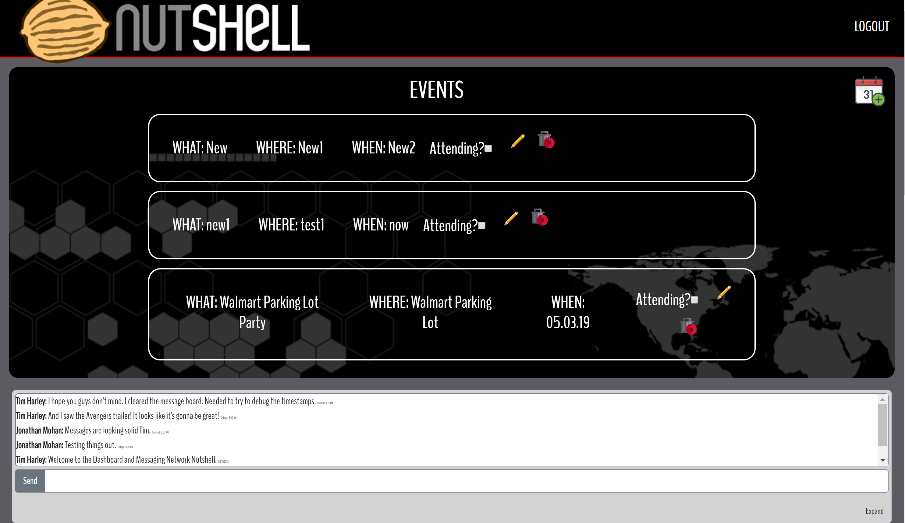

# nutshell
This is group project is a single page application that incorporates Firebase CRUD to authenticate and interact with multiple components. 

### How to run this app
* Clone the project and install all dependencies using the command line:
```sh
npm install
```
* Rename apiKeys.json.example file to apiKeys.json
* Create a new project in Firebase and add your api keys to apiKeys.json. 
* Create a free account at www.weatherbit.io and add the api code to the apiKeys.json file. 
* Run the server in terminal:
```sh
npm start
```

## Screenshots


